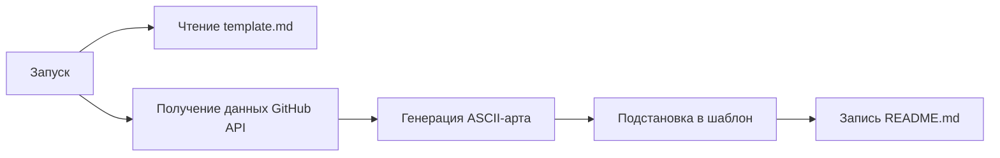

# How It Works

Это лёгкий Python-скрипт, который автоматически генерирует и обновляет GitHub README с помощью ASCII-арта. При запуске он забирает данные профиля через GitHub API, преобразует имя в текстовый баннер (pyfiglet), а аватар — в ASCII-символы или PNG (ascii_magic), после чего подставляет результат в шаблон и сохраняет в README.md. Работает в связке с GitHub Actions: обновляет профиль по расписанию и при пуше.

---

## Что делает скрипт



1. Берёт имя пользователя из `GITHUB_REPOSITORY_OWNER` (или fallback)
2. Случайно выбирает шрифт из `LIST_OF_FONTS`
3. Генерирует:
   - **Имя** → `pyfiglet` ASCII-арт
   - **Дату** → `pyfiglet` ASCII-арт  
   - **Аватар** → `ascii_magic` (raw-символы ASCII или PNG из них же)
4. Вставляет блок в `<!-- TERMINAL_PLACEHOLDER -->` шаблона
5. Сохраняет результат в `README.md`

---

## Конфигурация

Все настройки в начале `generate_readme.py`

### Шаблон `template.md`

Этот файл можно дополнить, всё кроме плейсхолдера будет в финальном README.
Обязателен плейсхолдер для замены на сгенерированный блок.

```markdown
<!-- TERMINAL_PLACEHOLDER -->
```

---

### Как скопировать к себе

Нажмите `Use this template`, назовите репозиторий своим ником, настройте `generate_readme.py` и запустите Actions.

## LICENSE

MIT, создано ChillLich
